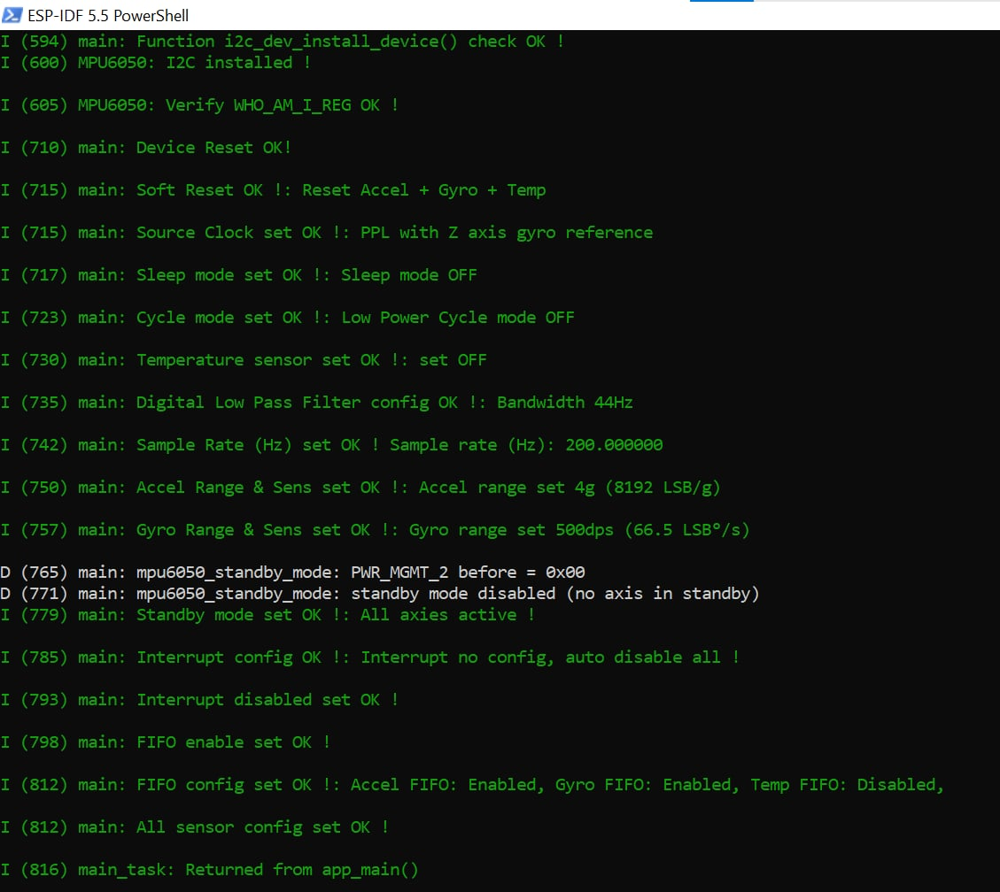
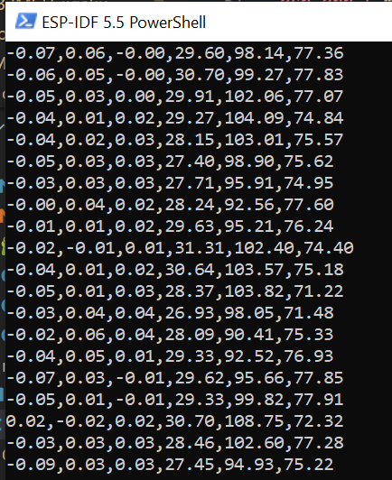

# MPU6050 - Accelerometor & Gyrscope API driver #
### Date: 2025/08/29 ###
### Author: Luong Huu Phuc ###

- Driver thư viện dành cho cảm biến MPU6050 dựa trên framework ESP-IDF
- Thư viện cung cấp API từ Low-Level đến cấp cao giúp cấu hình, đọc dữ liệu cảm biến (Accel/Gyro/Temp) một cách dễ dàng và tối ưu
- Ngoài ra còn hỗ trợ các cấu hình chi tiết cho việc thu thập dữ liệu (FIFO, interrrupt, full-scale range,...)

## Tính năng chính ##
- Hỗ trợ cấu hình: 
  - Clock source, Sleep Mode, Low Power Cycle Mode, Standby Mode
  - Accelerometer range: ±2g / ±4g / ±8g / ±16g
  - Gyroscope range: ±250 / ±500 / ±1000 / ±2000 dps
  - DLPF (Digital Low Pass Filter)
  - Sample rate (Hz) & FIFO
  - Interrupt (enable/config)
- Đọc dữ liệu:
  - Dữ liệu raw (ADC)
  - Dữ liệu đã scale (đơn vị g, dps, °C)
  - Đọc nhiều mẫu 1 lần từ FIFO hoặc Register
- Cấu trúc code tách biệt:
  - `mpu6050_.c`: Low-Level driver (I2C write/read)
  - `mpu6050_log.c`: Logger & Debug
  - `mpu6050.c`: API chính

## Hướng dẫn sử dụng ##

### 1. Clone và thêm vào project ###
```bash
git clone https://github.com/LuongHuuPhuc/MPU6050_driver_idf.git components/MPU6050
```
Thêm vào `CMakeLists.txt` hoặc idf_components.yml` nếu cần

### 2. Khai báo include ###
```c
#include "mpu6050_ll.h"
#include "mpu6050_log.h"
#include "mpu6050.h"
```
### 3. Cấu hình cảm biến ###
```c
esp_err_t mpu6050_set_config(mpu6050_config_t *config){
  mpu6050_config_t cfg = {
    .clock_source = MPU6050_CLK_PPL_ZGYRO, //Cau hinh clock source
    .reset = MPU6050_RESET_ALL, //Cau hinh soft reset
    .custom_mask = 0, //Custom mask trong soft reset neu chon MPU6050_RESET_CUSTOM
    .sleep_mode = MPU6050_SLEEP_MODE_DISABLE, //Khong Sleep Mode
    .cycle_mode = MPU6050_CYCLE_MODE_DISABLE, //Khong Low Poer Cycle Mode
    .temperature = false, //Khong dung cam bien nhiet do
    .dlfp_cfg = MPU6050_DLPF_44HZ, //Digital Low Pass Filter bandwidth cang thap -> tre cang cao -> nhieu thap hon
    .freq_hz = 200.0f, //Tan so lay mau 200Hz (Div = 4)
    .accel_range = MPU6050_ACCEL_FS_4G, //Dai do full-scale Accel
    .gyro_range = MPU6050_GYRO_FS_500DPS, //Dai do full-scale gyro
    .standby_mode.disable_standby = true, //Disable standby mode
    .int_cfg.disable = true, //Khong cau hinh tin hieu ngat 
    .interrupts.disable_int = true, //Disable ngat
    .fifo_enable = true, //Bat FIFO
    .accel_en = true, //FIFO nhan Accel data 
    .gyro_en = true, //FIFO nhan Gyro data
    .temp_en = false
  };
  memcpy(config, &cfg, sizeof(mpu6050_config_t));
  esp_err_t ret = mpu6050_sensor_config(&dev, config);
  return ret;
}
```
### 4. Đọc dữ liệu ###
```c
void mpu6050_readData_task(void *pvParameter){
  size_t samples = 5;
  mpu6050_scaled_data_t scaled_data[samples] ;
  while(1){
    mpu6050_read_scaled_multi_samples(&dev, scaled_data, MPU6050_READ_FIFO, mpu6050_cfg.sens, samples);
    for(size_t i = 0; i < samples; i++){
      printf("%.2f,%.2f,%.2f,%.2f,%.2f,%.2f\r\n", scaled_data[i].accel_x_g, scaled_data[i].accel_y_g, scaled_data[i].accel_z_g,
                                              scaled_data[i].gyro_x_dps, scaled_data[i].gyro_y_dps, scaled_data[i].gyro_z_dps);
    }
    vTaskDelay(pdMS_TO_TICKS(15)); //Tranh chiem CPU
  }
}
```
## Kết quả thực tế ##

### 1. Log cấu hình cảm biến ###


### 2. Log kết quả dữ liệu ###


### 3. Demo ###

***

## References ##
* Dependency: https://github.com/LuongHuuPhuc/I2C_dev_Middleware_Layer_idf
* Datasheet:  https://www.alldatasheet.com/datasheet-pdf/pdf/1132807/TDK/MPU-6050.html 

## Accelerometer và Gyroscope ##
- Đây là hai cảm biến quán tính, thường thấy trong các thiết bị như smartphone, drone, robot,...nhưng chúng lại đo **hai loại chuyển động khác nhau**: 

### 1. Accelerometer (Gia tốc kế) ###
- Đo **gia tốc tuyến tính (linear acceleration)** theo các trục x, y, z. Hoặc có thể hiểu là cảm biến đo *gia tốc trọng trường* 
- Nó cho biết vật thể đang chịu lực tác động theo hướng nào (ví dụ rơi tự do, bị nghiêng, rung động,...)
- Ứng dụng: 
  - Xác định thiết bị đang dựng đứng hay nằm ngang (xoay màn hình điện thoại,...)
  - Đếm bước chân (theo dao động khi đi bộ)
  - Phát hiện rơi tự do (bật cơ chế bảo vệ trong ổ cứng)
- Hạn chế: 
  - Không thể tự xác định được chính xác góc quay, vì nó không đo được chuyển động xoay mà chỉ đo được lực tuyến tính
  - Nếu tích phân nhiều lần sẽ dễ sinh ra sai số lớn 

### 2. Gyroscope (Con quay hồi chuyển) ###
- Đo **tốc độ góc(angular velocity)** quanh các trục x, y, z
- Nó cho biết đang xoay bao nhiêu, theo chiều nào
- Ứng dụng: 
  - Giữ thăng bằng drone, robot (biết đang xoay ngang bao nhiêu để điều chỉnh)
  - Điều khiển chuột bay, tay cầm chơi game (đo xoay)
  - Camera chống rung (OIS)
- Hạn chế:
  - Bị drift (trôi) theo thời gian nếu chỉ dựa vào gyro (tích phân vận tốc góc ra góc quay)